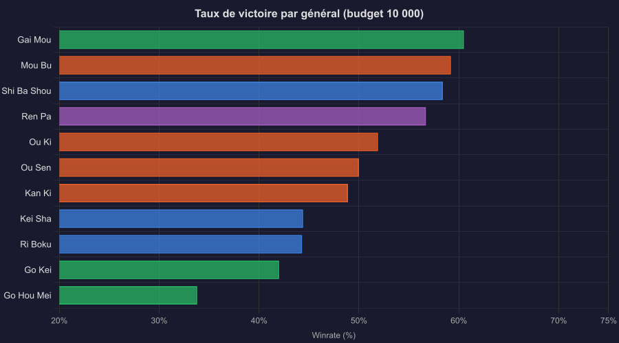
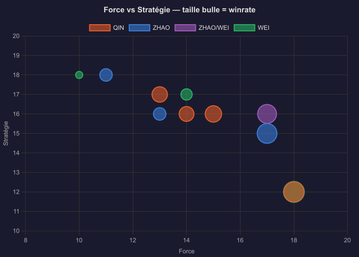
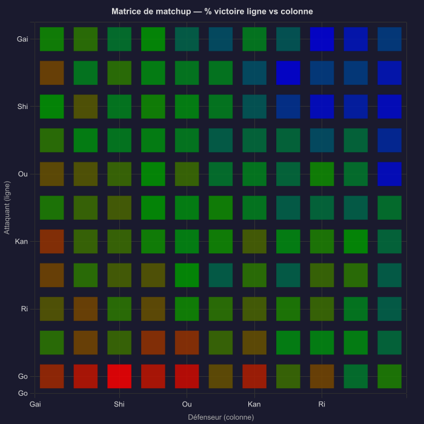
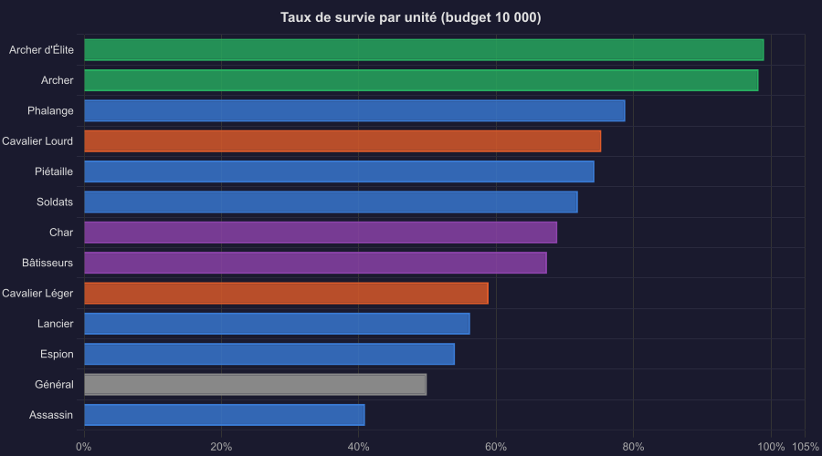
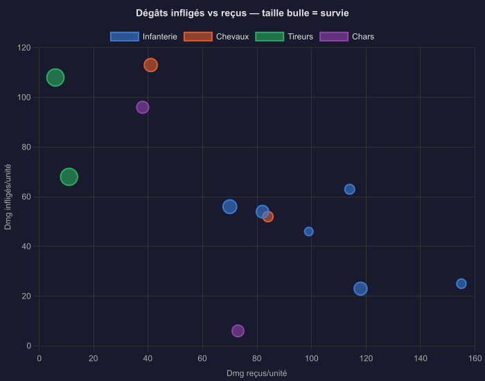
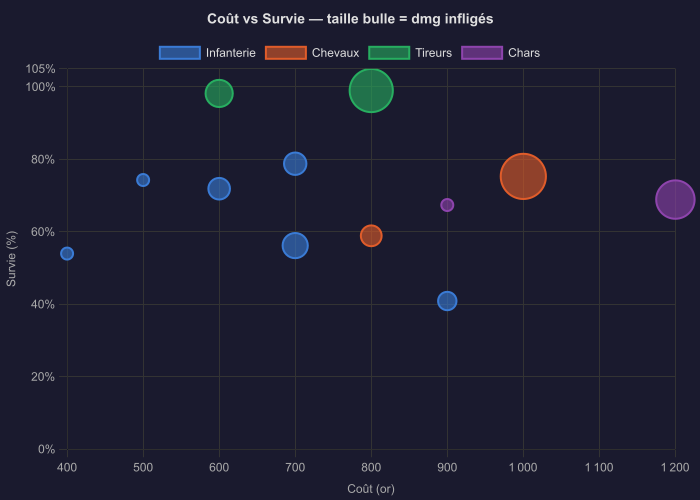
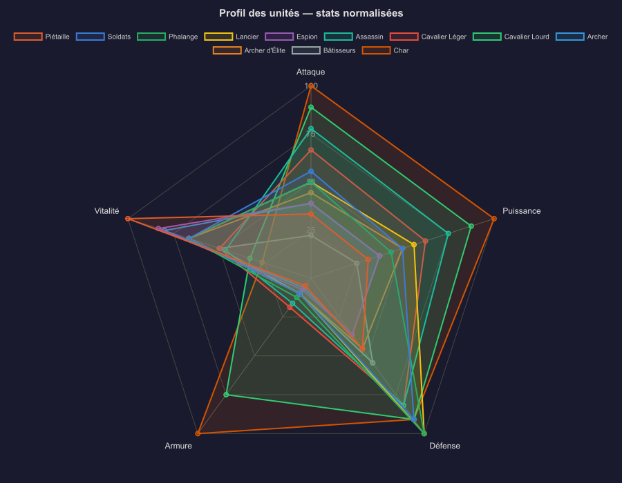
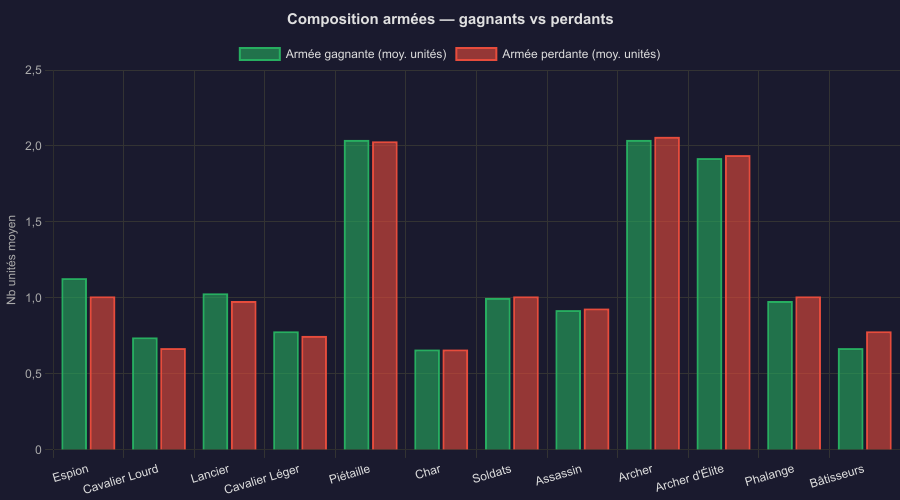

# Kingdom Battleground — Rapport de Simulation d'Équilibrage

**Date :** 2026-04-05
**Formule de combat :** N_Go = ⌊Vitalité/5⌋ dés D20 ≤ attaque. Dégâts = Att_réussite × Puissance × (1 − (NGO_def × Armure)/(NGO_def × Armure + 100)).
**Moral damage :** Att_réussite × Intimidation / Def_réussite × Intimidation.
**Bonus Lancier :** +6 Puissance contre Chevaux et Chars.

---

## SIMULATION PRINCIPALE — Budget 10 000 (50 parties/matchup, 6 050 total)

---

## 1. Équilibrage des Généraux



| # | Général | Royaume | Force | Strat | PV | Victoire | IC 95% | Verdict |
|---|---------|---------|-------|-------|----|----------|--------|---------|
| 1 | **Gai Mou** | WEI | 18 | 12 | 130 | **60.5%** | ±2.9% | Trop fort ⚠ |
| 2 | **Mou Bu** | QIN | 18 | 12 | 130 | **59.2%** | ±2.9% | Trop fort ⚠ |
| 3 | **Shi Ba Shou** | ZHAO | 17 | 15 | 130 | **58.4%** | ±2.9% | Fort |
| 4 | **Ren Pa** | ZHAO/WEI | 17 | 16 | 120 | **56.7%** | ±2.9% | Fort |
| 5 | **Ou Ki** | QIN | 15 | 16 | 110 | **51.9%** | ±3.0% | Équilibre ✓ |
| 6 | **Ou Sen** | QIN | 13 | 17 | 110 | **50.0%** | ±3.0% | Équilibre ✓ |
| 7 | **Kan Ki** | QIN | 14 | 16 | 100 | **48.9%** | ±3.0% | Équilibre ✓ |
| 8 | **Kei Sha** | ZHAO | 13 | 16 | 100 | **44.4%** | ±2.9% | Faible |
| 9 | **Ri Boku** | ZHAO | 11 | 18 | 100 | **44.3%** | ±2.9% | Faible |
| 10 | **Go Kei** | WEI | 14 | 17 | 90 | **42.0%** | ±2.9% | Faible |
| 11 | **Go Hou Mei** | WEI | 10 | 18 | 80 | **33.8%** | ±2.8% | Injouable ⚠ |

### Force vs Stratégie



**Constat :** Force domine toujours. Les 4 premiers ont Force ≥ 17. Les 4 derniers ont Force ≤ 14 malgré haute Stratégie. Ou Ki (Force 15, Strat 16) reste la référence stable à 52%.

---

## 2. Matrice de Matchup



```
          Ou Ki  Mou Bu  Ou Sen  Kan Ki  Ri Boku Kei Sha ShiBaSh  Ren Pa  Go Kei  GoHouM  Gai Mou
Ou Ki       42%    38%    56%    54%     48%     58%     42%     50%     56%     78%     36%
Mou Bu      54%    54%    54%    64%     68%     80%     44%     52%     68%     76%     34%
Ou Sen      52%    42%    48%    54%     58%     60%     40%     50%     60%     56%     46%
Kan Ki      52%    42%    48%    40%     46%     52%     42%     48%     50%     58%     30%
Ri Boku     48%    34%    44%    40%     42%     46%     44%     36%     54%     60%     38%
Kei Sha     50%    44%    60%    44%     42%     60%     40%     38%     44%     60%     34%
Shi Ba S    52%    38%    54%    62%     78%     70%     54%     48%     74%     78%     50%
Ren Pa      54%    52%    60%    58%     64%     58%     54%     52%     58%     72%     44%
Go Kei      30%    34%    42%    36%     52%     52%     42%     30%     52%     58%     44%
Go Hou M    22%    24%    36%    26%     34%     42%     16%     24%     56%     46%     28%
Gai Mou     60%    44%    64%    54%     80%     62%     56%     50%     76%     68%     48%
```

---

## 3. Efficacité des Unités



| # | Unité | Catégorie | Coût | Survie | IC 95% | Dmg infligés/u | Dmg reçus/u | Verdict |
|---|-------|-----------|------|--------|--------|----------------|-------------|---------|
| 1 | **Archer d'Élite** | Tireurs | 800 | **99.0%** | ±0.1% | 108 | 6 | Trop fort ⚠ |
| 2 | **Archer** | Tireurs | 600 | **98.2%** | ±0.2% | 68 | 11 | Trop fort ⚠ |
| 3 | **Phalange** | Infanterie | 700 | **78.8%** | ±0.7% | 56 | 70 | Tank solide |
| 4 | **Cavalier Lourd** | Chevaux | 1000 | **75.3%** | ±0.9% | 113 | 41 | Très efficace |
| 5 | **Piétaille** | Infanterie | 500 | **74.3%** | ±0.5% | 23 | 118 | Masse correcte |
| 6 | **Soldats** | Infanterie | 600 | **71.9%** | ±0.8% | 54 | 82 | Correct |
| 7 | **Char** | Chars | 1200 | **68.9%** | ±1.0% | 96 | 38 | Efficace |
| 8 | **Bâtisseurs** | Chars | 900 | **67.4%** | ±1.0% | 6 | 73 | Utilitaire pur |
| 9 | **Cavalier Léger** | Chevaux | 800 | **58.9%** | ±1.0% | 52 | 84 | Fragile |
| 10 | **Lancier** | Infanterie | 700 | **56.2%** | ±0.9% | 63 | 114 | Fragile |
| 11 | **Espion** | Infanterie | 400 | **54.0%** | ±0.9% | 25 | 155 | Très fragile |
| 12 | **Assassin** | Infanterie | 900 | **40.9%** | ±0.9% | 46 | 99 | Injouable ⚠ |

### Dégâts infligés vs reçus



### Coût vs Survie (value for money)



### Profil des unités — stats normalisées



---

## 4. Composition des Armées — Gagnants vs Perdants



Les unités que les armées gagnantes achètent significativement plus que les perdantes sont les plus impactantes sur le résultat d'une partie.

---

## 5. Analyse et Recommandations

### Problèmes urgents

1. **Archers injouables en équilibre (98-99% survie)** : la mécanique `ranged_no_defense` combinée à leur haute vitalité (NGO élevé) les rend structurellement invincibles. Ratio Archer d'Élite : 108 dmg infligés / 6 reçus → **18:1**. Solutions :
   - Réduire vitalité (Archer : 240→160, Élite : 200→140)
   - Ou permettre une défense partielle à portée 1-2

2. **Assassin injouable (40.9%)** : reçoit 99 dmg, inflige seulement 46. Son attaque 14 et puissance 12 sont insuffisantes pour justifier son coût 900g. Buff offensif nécessaire.

3. **Go Hou Mei toujours injouable (33.8%)** : Force 10 trop faible, ses unités tirent moins profit du bonus NGO en attaque. Buff Force 10→13 recommandé.

### À surveiller

4. **Gai Mou / Mou Bu** (60-61%) : Force 18 avantage trop fort à 10k budget. Reste dans les 60% contrairement au budget 2500 (73-74%) — le problème se réduit avec les grandes armées.

5. **Cavalier Léger (58.9%)** et **Lancier (56.2%)** : trop fragiles. Reçoivent beaucoup de dégâts pour des unités de 700-800g.

6. **Espion (54%)** : reçoit 155 dmg/unité — fragile mais rôle utilitaire (vision, infiltration) justifie partiellement.

### Fonctionne correctement

- **Ou Ki / Ou Sen / Kan Ki** : cluster équilibré 49-52%, excellente zone de confort.
- **Cavalier Lourd** : excellent rapport coût/efficacité (75% survie, 113 dmg infligés pour 1000g).
- **Char** : 68.9% survie, 96 dmg infligés — justifie son coût 1200g.
- **Phalange** : bon tank (78.8% survie) malgré une offensive modeste.

---

## 6. Notes Méthodologiques

- **Agent IA** : Heuristique. Ne joue pas les capacités spéciales. Espion, Bâtisseurs et Assassin sous-évalués vs leur potentiel réel en jeu humain.
- **Formule armure :** `ratAR = 1 − (NGO_def × Armure) / (NGO_def × Armure + 100)` — l'armure scale avec le nombre de soldats du défenseur. Les unités à haute vitalité + haute armure (Cav. Lourd armor:60, Char armor:80) sont extrêmement résistantes.
- **Moral damage :** inclus dans la simulation mais non reflété dans les taux de survie (moral séparé des PV).
- **Budget :** 10 000 or. Toutes les unités sont accessibles à ce budget.
